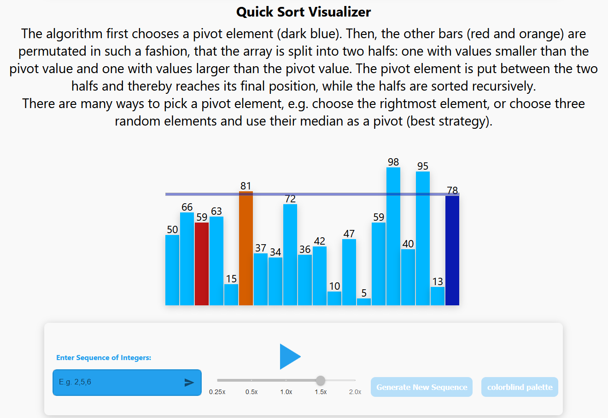

# Visualization of Sorting Algorithms

This repository is part of the coursework deliverable for the **Visualization 2022** course at the **University of Göttingen**. It features interactive visualizations of well-known sorting algorithms, including **Quicksort** and **Merge Sort**, built with **React.js**. Additionally, the project includes **time complexity charts** to illustrate performance differences.

## Example Visualization


## 🚀 Getting Started
To run the project locally:
1. **Navigate to the project folder**
```sh
cd visualization
```
2. **Install dependencies**

```sh
npm install
```

3. **Start the development server**
```sh
npm start
```
4. **Open your browser and visit** http://localhost:3000


## ⚠️ Known Issue: Time Complexity Chart Scaling
The **x-axis scaling** in time complexity charts may appear **uneven** due to a **bug in ApexCharts** when using customized x-axis values in **Google Chrome**.

### Workaround
To correctly display the charts in **Firefox** or other browsers:
1. **Modify all** `.js` files in the `src/Charts` folder.
2. **Uncomment the lines** specifying the intended maximum x-axis value.

Once modified, the charts should render correctly in supported browsers.